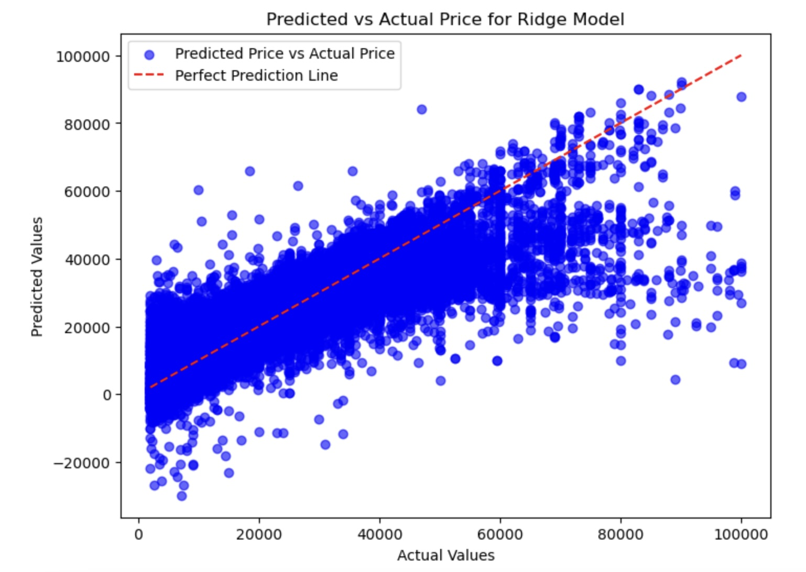
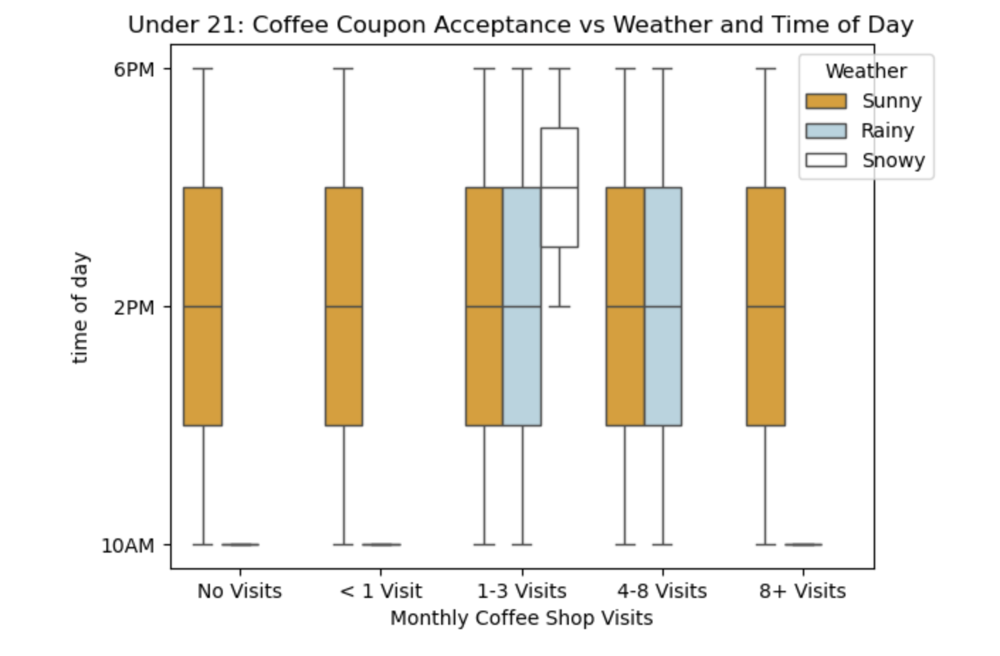
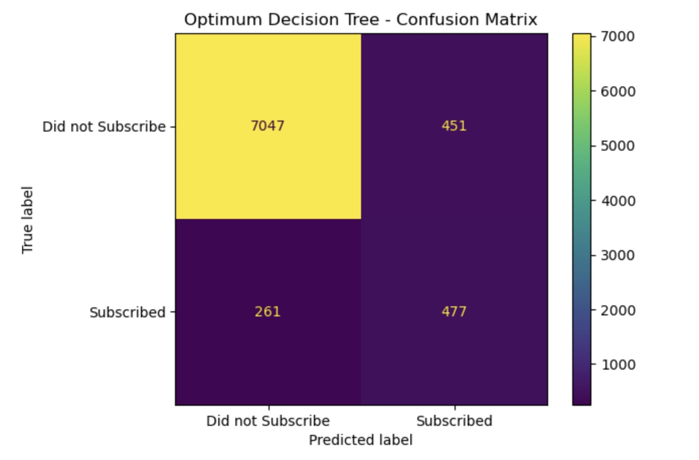
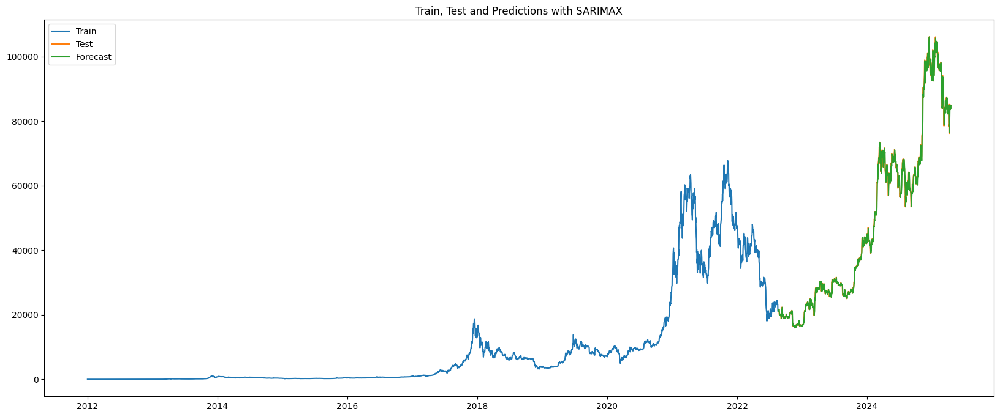

# AI Machine Learning Portfolio

### Used Car Prices
For dealerships to determine the vehicles features, that drive used car prices.

**ML Project with code, and data visualizations and analysis: [here](used_car_prices).**

### Coupon Analysis
Will a driver accept the coupon?

**ML Project with code, and data visualizations and analysis: [here](coupons).**

### Marketing Campaign
During a marketing campaign, will a bank client subscribe to a term deposit?

**ML Project with code, and data visualizations and analysis: [here](marketing_campaign).**

### Predicting Tomorrow's Bitcoin Price
Predicting the next day’s Bitcoin closing price on a daily timeframe, our SARIMAX baseline achieved a Mean Absolute Percentage Error **(MAPE) of 1.77%** and an Mean Absolute Error **(MAE) of $898.27**. 

A Lasso regression model offered only a marginal improvement—reducing MAE by about $2—while matching the same 1.77% MAPE. 

Overall, SARIMAX remains a strong benchmark for daily Bitcoin price forecasts.

**ML Project with code, and data visualizations and analysis: Available via walkthru over Zoom.  Not open to the public.**

#### Contact and Further Information
Shawn Arney  
Shawn@ArneyConsulting.com

(719) 428-5126  
https://www.linkedin.com/in/shawnarney/