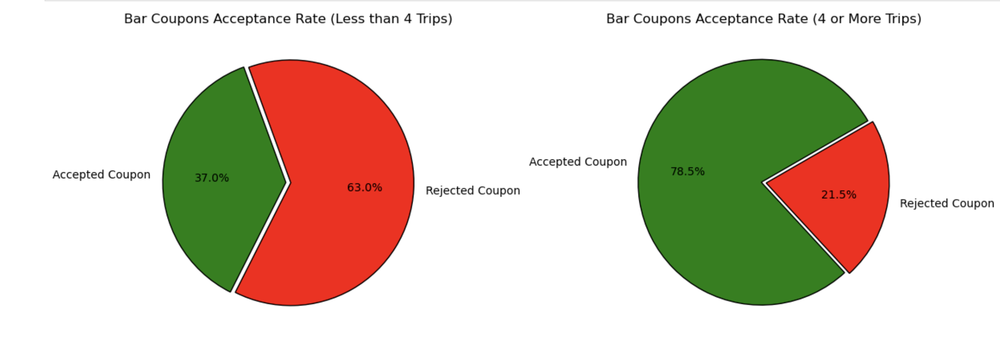
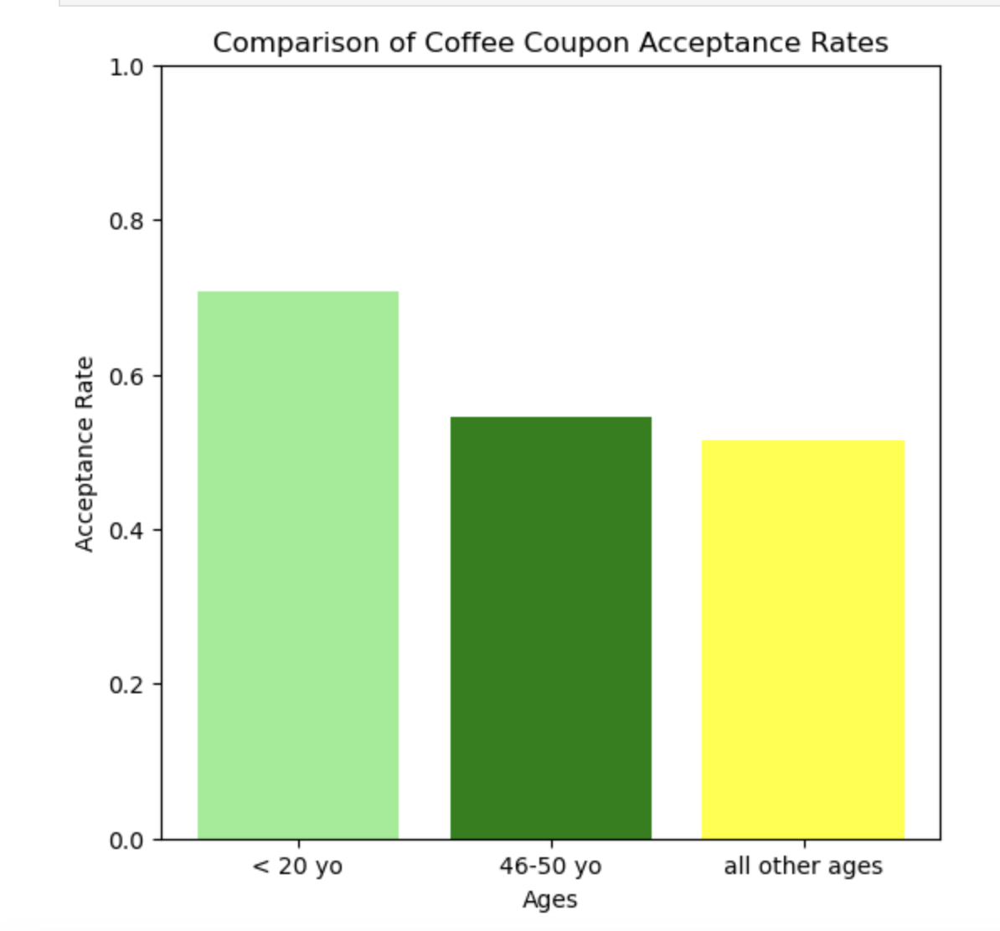

# Will a driver accept the coupon?

**Jupyter Notebook with code, and data visualizations and analysis: [here](https://github.com/shawnarneygit/ai_machine/blob/master/coupons/coupons.ipynb).**

## Business Goal
Distinguish between customers who accepted a driving coupon versus those who did not.

## Data
This data is from the UCI Machine Learning Repository and was collected via a survey on Amazon Mechanical Turk. The survey describes different driving scenarios, including the destination, current time, weather, and passenger, and then asks people whether they will accept the coupon if they are the driver. 

There are three possible answers people can choose from:
“Right away”
“Later, before the coupon expires”
“No, I do not want the coupon”

The first two responses are labeled as “Y = 1,” and the third is labeled as “Y = 0.” There are five different types of coupons: Less expensive restaurants (under $20), coffee houses, carryout and takeaway, bars, and more expensive restaurants ($20–$50).

[Coupon dataset](https://github.com/shawnarneygit/ai_machine/blob/master/coupons/data/coupons.csv)

## Modeling and performance
Acceptance rates for Bar and Coffee coupons were compared across various age groups and demographic characteristics. 

Heatmaps, histograms, bar charts, and pie charts were employed to visualize and compare these percentages between different characteristics and features.

# Conclusions and Findings

## Bar Coupon Acceptance 

### Key Findings:
1. **Frequent Bar Visitors**:
   - Drivers who visit the bar **more than 4 times a month** are **twice as likely** to accept bar coupons compared to others.

2. **Impact of Child Passengers**:
   - Drivers who visit the bar **more than once a month** and have **no child passenger** are at least **60% more likely** to accept the coupon than other drivers.

### Conclusion:
Frequent bar visitors and drivers without child passengers show significantly higher coupon acceptance rates. These insights can help refine coupon targeting strategies for maximum impact.

## Coffee Coupon Acceptance Conclusion

### Key Findings:
1. **Overall Coupon Acceptance**:
   - Coffee coupon acceptance is at least **~30% more likely** if the customer is **under 21 years old**.

2. **Influence of Weather on Acceptance for Under 21s**:
   - **Sunny Weather**: 
     - Under 21s **always accepted** the coupon during sunny weather.
   - **Rainy Weather**: 
     - Only those with **1-8 visits** for the month accepted the coupon.
   - **Snowy Weather**: 
     - Acceptance was limited to those with **1-3 visits** for the month.
     - Coupons were only accepted during the **2-6 PM time window**.

### Conclusion:
Under-21 customers are at least 30% more likely to accept coffee coupons compared to older groups. Weather conditions also significantly affect acceptance rates among younger customers, with distinct patterns influenced by weather type and visit frequency. These insights can help businesses optimize their coupon distribution strategies.

### Actionable insights

- **Bar Coupons:** Sending coupons to those with at least one bar visit a month and without a child passenger.  Has a 60%+ more effective response rate.  

- **Coffee Coupons**: Under 21 year olds, is a signficant demographic to target for coffee coupons.  And in snowy weather, focusing on the under 21's who have only visited 1-3 times for the month, has a positive return.
